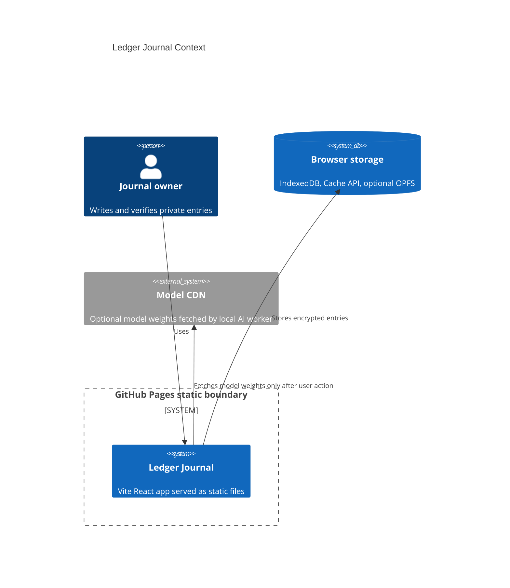

# Ledger Journal

https://baditaflorin.github.io/ledger-journal/

Ledger Journal is a private, offline-first journal with encrypted, hash-chained entries and exportable cryptographic proof bundles.

[](https://github.com/baditaflorin/ledger-journal)
[](https://baditaflorin.github.io/ledger-journal/)
[](LICENSE)

## Quickstart

```sh
npm install
make install-hooks
make dev
make test
make smoke
```

## What It Does

Ledger Journal stores entries only in the browser using IndexedDB. Each entry is encrypted with age, hash-chained to the previous entry, signed with Ed25519, and included in Merkle checkpoints that can be exported as proof bundles. DuckDB-WASM, local text generation, and Whisper transcription load lazily behind user actions.

Repository: https://github.com/baditaflorin/ledger-journal

Support: https://www.paypal.com/paypalme/florinbadita

## Architecture



More detail: docs/architecture.md

ADRs: docs/adr/

Deployment guide: docs/deploy.md

Privacy notes: docs/privacy.md
