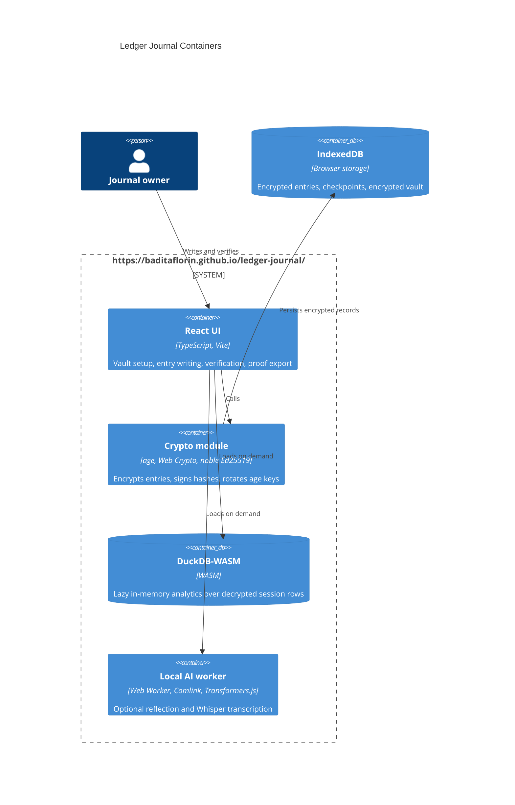

# Architecture

Ledger Journal is Mode A: a static GitHub Pages app with no runtime backend.

The GitHub Pages boundary serves static files only. Journal data, passphrases, identities, signing keys, plaintext entries, and proof exports never leave the browser unless the user downloads or publishes them.
